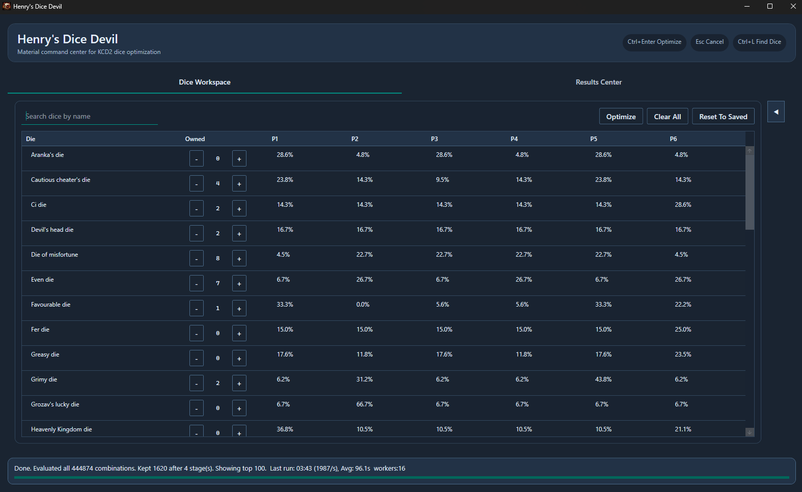
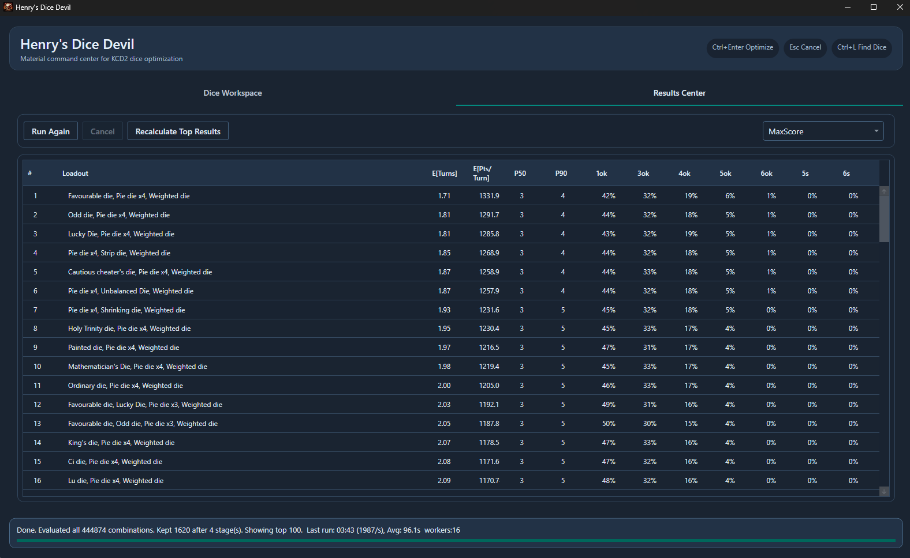

# Henry's Dice Devil


Henry's Dice Devil sits on your shoulder and tells you which dice to play to win every time. Give it the dice you own, and it runs simulations to find the best possible loadouts for your goals, whether that goal is to score as many points as possible or roll only straights.

## How The Optimizer Works
Henry's Dice Devil solves: "Given my owned dice, which 6-die loadout is best for my objective?"

High-level pipeline:

1. Load dice probability catalog from `data/kcd2_dice_probabilities.json`.
2. Build available inventory from UI-owned dice.
3. Enumerate all valid 6-die count vectors from that inventory.
4. Evaluate each loadout with Monte Carlo turn simulation.
5. Convert per-turn distribution to decision metrics (`E[Turns]`, `E[Pts/Turn]`, `P50`, `P90`).
6. Rank loadouts by selected objective.
7. Return top-N in the Results Center.

### Simulation details
- Core engine: `src/HenrysDiceDevil.Simulation/Runtime/TurnSimulationEngine.cs`
- For each loadout, the engine runs `NumTurns` stochastic turn simulations.
- Each turn:
  - rolls remaining dice using each die's face distribution,
  - scores all legal scoring groups,
  - chooses a scoring selection via risk policy (Conservative/Balanced/Aggressive),
  - either banks or keeps rolling based on bust risk and bank thresholds.
- After all turns:
  - computes mean points and variance,
  - computes turns-to-target metrics from dynamic programming over the turn-score distribution.

### Ranking details
- Ranking logic: `src/HenrysDiceDevil.Simulation/Optimization/ObjectiveRanking.cs`
- `MaxScore` ranks by lowest `E[Turns]`, tie-break on higher `E[Pts/Turn]`.
- Other objectives rank by frequency of tagged scoring patterns (straights, singles, kinds), tie-break on lower `E[Turns]`.

### Efficiency mode (staged pruning)
When enabled, optimization uses stages from the Efficiency plan:

- Each stage evaluates candidates with that stage's `Pilot Turns`.
- Then it keeps top candidates by:
  - `Keep %`,
  - `Epsilon` boundary widening,
  - `Min Survivors` floor.
- Final stage typically uses high turn count for accurate final ranking.

Defaults:
- Stage 1: `MinTotal=100000, PilotTurns=100, Keep%=30, Epsilon=0.1, MinSurvivors=100`
- Stage 2: `MinTotal=10000, PilotTurns=500, Keep%=10, Epsilon=0.05, MinSurvivors=100`
- Stage 3: `MinTotal=1000, PilotTurns=1000, Keep%=10, Epsilon=0, MinSurvivors=100`
- Stage 4: `MinTotal=0, PilotTurns=50000, Keep%=100, Epsilon=0, MinSurvivors=100`

`Turns` setting is only used when Efficiency mode is OFF.

### Cache and reproducibility
- Cache implementation: `src/HenrysDiceDevil.Infrastructure/Caching/FileResultCacheStore.cs`
- Storage: SQLite (`cache/cache.db`) with async write-behind, WAL mode.
- Cache keys include dice signature + simulation settings (+ seed where applicable), so cached results stay context-correct.
- Quality validation is statistical, not RNG-sequence identity.

## Features
- Exhaustive loadout search over owned inventory.
- Multiple objectives (MaxScore + pattern-focused objectives).
- Risk profiles (Conservative/Balanced/Aggressive).
- Efficiency staged pruning for very large candidate sets.
- High-throughput parallel evaluation with selectable performance profile.
- Re-rank existing run results without rerunning simulation.
- Persistent runtime state:
  - owned dice,
  - UI settings,
  - UX run metrics,
  - simulation cache.
- Built-in cache clear button.
- Keyboard shortcuts:
  - `Ctrl+Enter`: Optimize
  - `Esc`: Cancel active run
  - `Ctrl+L`: Focus dice search
  - `Ctrl+D`: Go to Dice tab
  - `Ctrl+T`: Recalculate top results

## Screenshots




## Repository Layout
- `src/HenrysDiceDevil.App`: WPF desktop application.
- `src/HenrysDiceDevil.Domain`: domain models/settings/contracts.
- `src/HenrysDiceDevil.Simulation`: simulation and optimization engine.
- `src/HenrysDiceDevil.Infrastructure`: data loading and cache infrastructure.
- `src/HenrysDiceDevil.TestRunner`: deterministic test harness and quality validation.
- `benchmarks/HenrysDiceDevil.Benchmarks`: performance benchmark app + compare mode.
- `tests/data`: ground-truth fixtures.
- `data`: dice probability catalog.

## Requirements
- Windows (for WPF app runtime).
- .NET SDK 10 (`net10.0-windows` target).

## Build And Run
From repository root:

```powershell
dotnet restore henrys-dice-devil.sln
dotnet build henrys-dice-devil.sln
dotnet run --project src/HenrysDiceDevil.App/HenrysDiceDevil.App.csproj
```

## Publish
Example self-contained publish:

```powershell
dotnet publish src/HenrysDiceDevil.App/HenrysDiceDevil.App.csproj -c Release -r win-x64 --self-contained true
```

The dice catalog is published with the app:
- source: `data/kcd2_dice_probabilities.json`
- runtime location: `<publish-dir>/data/kcd2_dice_probabilities.json`

## User Guide
### Dice Workspace
- Set owned counts for each die.
- Search/filter dice by name.
- `Optimize` runs exhaustive optimization using current setup.
- `Clear All` zeroes counts.
- `Reset To Saved` restores last persisted owned counts.

Special handling:
- `Ordinary die` is always treated as owned count 6 for loadout generation.
- Other perfectly uniform dice are ignored during loadout generation (equivalent to ordinary die behavior).

### Run Setup
- `Max Score`: target score slider.
- `Performance`: maps to worker count.
- `Risk Profile`: controls policy aggressiveness.
- `Scoring Type to Prefer`: primary ranking objective.
- `Enable Efficiency Mode`: enables staged pruning.
- `Show Advanced`: reveals Settings and Advanced tabs.

### Settings tab
- `Turns (Efficiency Off)`: active only when Efficiency mode is OFF.
- `Efficiency Seed`: deterministic pilot stage seed base.
- `Reset Settings`: restore recommended defaults.
- `Clear Cache`: deletes cached simulation results.

### Advanced tab
- Edit efficiency stages:
  - `Min Total`,
  - `Pilot Turns`,
  - `Keep %`,
  - `Epsilon`,
  - `Min Survivors`.
- Validation rules enforce sane ordering and value bounds.

### Results Center
- Displays ranked loadouts and summary metrics:
  - `E[Turns]`, `E[Pts/Turn]`, `P50`, `P90`,
  - grouped scoring pattern rates (`1_ok`, `3_ok`, `5_s`, etc.).
- `Recalculate Top Results` re-ranks latest results with selected objective.
- Top rows shown:
  - Efficiency OFF: top 50.
  - Efficiency ON: final stage `Min Survivors`.

## Runtime Data And Persistence
Runtime root is app base directory (`AppContext.BaseDirectory`).

Files created/used at runtime:
- `data/kcd2_dice_probabilities.json` (read on startup)
- `cache/cache.db` (SQLite simulation cache)
- `cache/owned-dice-state.json`
- `cache/ui-state.json`
- `cache/ux-metrics.json`

## Quality Validation
Run the test harness:

```powershell
dotnet run --project src/HenrysDiceDevil.TestRunner/HenrysDiceDevil.TestRunner.csproj -c Release
```

Ground-truth statistical benchmark test is optional by default and enabled with:

```powershell
$env:KCD2_RUN_GROUND_TRUTH_BENCHMARK = "1"
dotnet run --project src/HenrysDiceDevil.TestRunner/HenrysDiceDevil.TestRunner.csproj -c Release
```

Ground-truth report output:
- `cache/validation/ground_truth_inventory_1000_turns_report.json`

Pass criteria includes:
- out-of-bounds loadouts <= 2%,
- overlap of ground-truth top-10 inside observed top-20 >= 9/10.

## Performance Benchmarking
Run benchmark app:

```powershell
dotnet run --project benchmarks/HenrysDiceDevil.Benchmarks/HenrysDiceDevil.Benchmarks.csproj -c Release -- --json benchmarks/results/performance-report.json --report docs/performance-baseline.md --workers 1 --iterations 1
```

Compare current report to baseline:

```powershell
dotnet run --project benchmarks/HenrysDiceDevil.Benchmarks/HenrysDiceDevil.Benchmarks.csproj -c Release -- compare --baseline benchmarks/baselines/perf-main-linux-x64.json --current benchmarks/results/performance-report.json --thresholds benchmarks/thresholds.json
```

Useful benchmark flags:
- `--scenarios small,medium,large,ground_truth`
- `--cache-modes cold|warm|both`
- `--worker-sweep 1,2,4,8`
- `--app-like`
- `--progress-interval-ms <n>`
- `--cache-async true|false`
- `--no-markdown`
- `--no-json`
